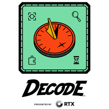

# 📘 Manual FIRST Tech Challenge – DECODE™ (PT-BR)

  

Este repositório contém um **site educacional** com a **tradução para o português brasileiro** do **Competition Manual da FIRST Tech Challenge – Temporada DECODE™ (2025–2026)**.

O objetivo do projeto é **facilitar o acesso ao manual oficial** para estudantes, mentores e equipes brasileiras, promovendo **inclusão, acessibilidade e melhor compreensão das regras da temporada**.

---

## 🌍 Sobre a FIRST Tech Challenge

A **FIRST® Tech Challenge (FTC)** é um programa educacional de robótica focado em STEM, trabalho em equipe e inovação, promovendo valores como **Gracious Professionalism®** e **Coopertition®**.

Na temporada **2025–2026**, o desafio é:

> 🧩 **DECODE™ – Presented by RTX**

Inspirado em arqueologia, descoberta e interpretação de padrões.

---

## 🎯 Objetivo do Site

- 📖 Manual da temporada DECODE traduzido para PT-BR  
- 🧠 Apoio ao entendimento de regras e pontuação  
- ♿ Acessibilidade para a comunidade brasileira  
- 🏫 Suporte a estudantes, mentores e escolas  

---

## ⚠️ Aviso Importante (Disclaimer)

- ❗ Este projeto **NÃO é uma tradução oficial da FIRST®**
- 📄 O manual oficial em inglês é a **fonte final**
- 🧑‍⚖️ Em caso de divergência, prevalece a versão oficial da FIRST

Projeto educacional, **sem fins lucrativos**.

---

## 🛠️ Tecnologias Utilizadas

- HTML5
- CSS3
- JavaScript
- GitHub Pages

---

## 🚀 Acesso a
---

## 📜 Licença

Todos os direitos do conteúdo original pertencem à  
**FIRST® (For Inspiration and Recognition of Science and Technology)**.

